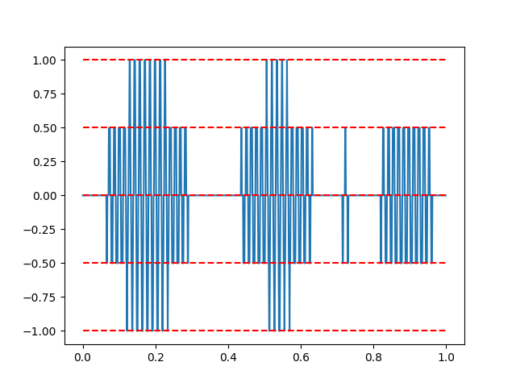

# Audio Compression TODO

Music can be digitized: when you listen to music on your computer, it is encoded using bits.
We now wonder how many bits are needed for this.
For this we need to know how digitization of sound works.

Sound is actually a wave.
For example, a one second sound wave could look like

However, this is a continuous *analog* signal.
Our digital computers cannot deal with those directly: they need the sound data in a digital format, i.e., as a finite list of numbers.

## Sampling

In order to digitize the sound wave, we need to *sample* it, i.e.,
we "measure" the value of the wave at specific intervals.
If we were to measure it every tenth of a second (sample rate of 10), we would get

The vertical red lines show the instances at which we sampled the sound wave.
The dots are the actual samples, and the blue line connects the dots and is an attempt
at reconstructing the original sound wave.

As you can see, the blue line barely looks like the original signal.
A sampling rate of just 10 is clearly insufficient.
Let's double it:

Meh.
We need more.
(But let's omit the red vertical lines for the sake of clarity.)

More!
We drive it up to 1000.

Aha.
That's more like it.

In reality, sound waves should be sampled at a rate of at least 40,000 samples per second.
This has to due with human hearing: we can hear sounds of up to 20,000Hz,
and to be able to faithfully reconstruct it (as proven by [Harry Nyquist](https://en.wikipedia.org/wiki/Nyquist_frequency)), we need a sample rate double of that.
This is why audio streams (audio CDs, Spotify, ...) typically have a sampling rate of 44,100Hz.

## Quantization

Sampling corresponds to cut the data along the horizontal axis.
The same needs to be done vertically.

Let's see what happens if we allow just 3 levels.

Myeah.
Let's add some more.

I think we need more.

Still not enough.

These days, actual audio is quantized using at least 65,536 levels,
which corresponds to 16 bit per sample.

This [YouTube video]((https://www.youtube.com/watch?v=QqIm3-jVUs8)) demonstrates what the different sample rates and bit depths actually sound like.

## Computing Bitrate

Let's now determine how much storage we need per second of audio.

* Per second we take `N` samples.
* For each sample, we use `K` bits to represent the "height" of the sound wave.
* This needs to be done for every channel of music.
  In other words, stereo sound (2 channels: left and right) requires twice the amount of storage than mono sound (1 channel).
  Let's say we have `C` channels.

Putting this all together, we need `N` &times; `K` &times; `C` bits per second to store audio.
This number is called the *bitrate*.

If calculated this way, you'll discover that a four minute song would take 40MiB,
which is huge.

## Compression

Luckily, we have developed all kinds of very fancy algorithms to *compress* this audio, so that it only requires a fraction of the storage.
Compressing often involves finding a balance between quality and storage needs: you can make the audio files very small, but the quality will suffer.

## Question

For this challenge, we ask you to find out how much bandwidth Spotify saves on thanks to compression.
Assume the following:

* Bitrate: 44,100 samples per second.
* Bits per sample (bit depth): 16.
* Stereo sound.
* Spotify's bitrate in compressed form: 160,000 bits per second.

So, start with computing how much one second of audio would take uncompressed (formula is given above).
Then divide it by Spotify's bitrate.
The resulting number represents how many times smaller the audio files have become thanks to compression.

For example, if we need 1000 bits per second for uncompressed music and 200 bits per second for compressed music, the answer would be 5.
